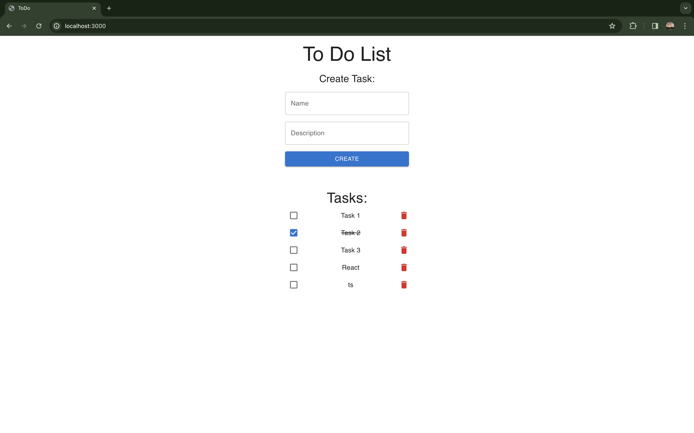

# Simple to-do-list



## Technology 

<p> 
    
    
    
    
</p>

## Installation 

1. Clone the repository: 

```bash
git clone https://github.com/khodosevich/to-do-list
```

2. Navigate to the project directory:

```bash
cd to-do-list
```

3. Install dependencies:

```bash
npm i
```

4. Run the application:

```bash
npm run dev
```

